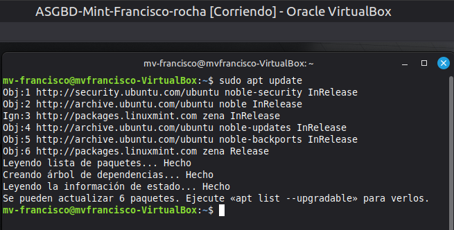

# -Practica-2.2-ASIR2-ASGBD
1. Desplegar Oracle Database 23ai Free con Podman
   Preparar Podman y descargar la imagen
```bash
sudo apt update

sudo apt install podman
sudo podman pull container-registry.oracle.com/database/free:23.5.0.0
sudo podman images
```
