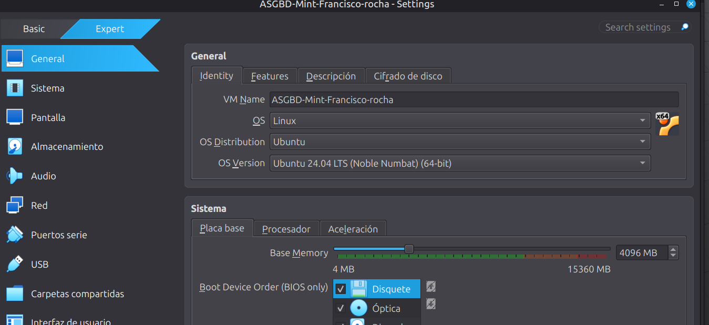
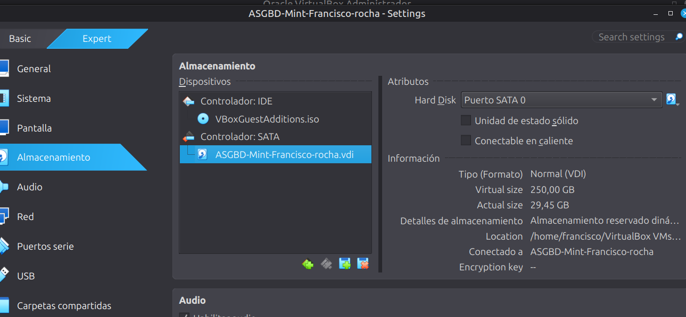
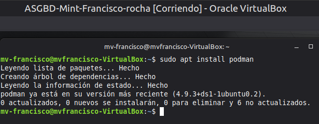
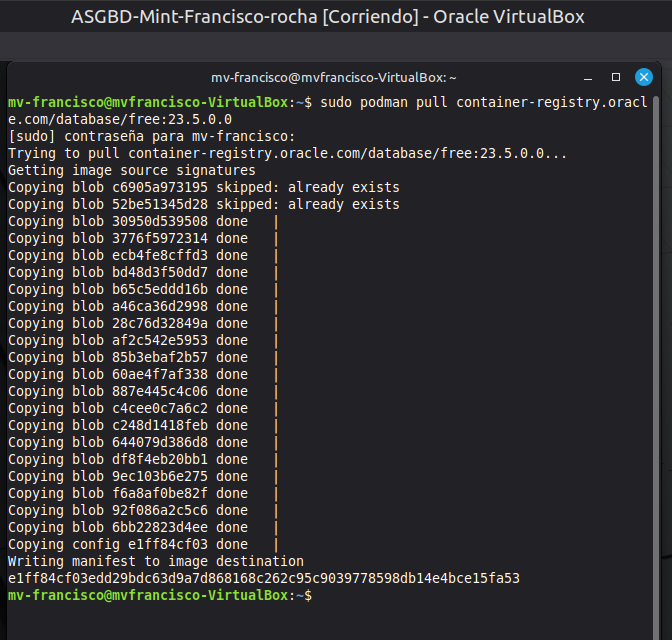
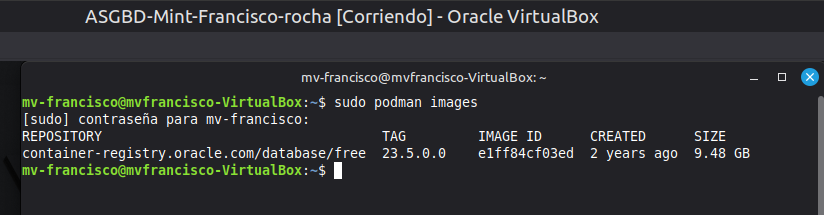

# -Practica-2.2-ASIR2-ASGBD
## Desplegar Oracle Database 23ai Free con Podman 
Configuracion de la maquina virtual
  
  
1. Preparar Podman y descargar la imagen  
   
sudo apt update  
  
sudo apt install podman  
  
sudo podman pull container-registry.oracle.com/database/free:23.5.0.0  
  
sudo podman images  
  

2.Crear y comprobar el contenedor
sudo podman volume create oracle_23ai_datos

