# -Practica-2.2-ASIR2-ASGBD
1. Desplegar Oracle Database 23ai Free con Podman 
Configuracion de la maquina virtual
  
  
   1.1 Preparar Podman y descargar la imagen  
   
sudo apt update  
  
sudo apt install podman  
  
sudo podman pull container-registry.oracle.com/database/free:23.5.0.0  
  
sudo podman images  
  

   1.2 Crear y comprobar el contenedor  
sudo podman volume create oracle_23ai_datos  
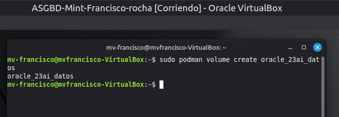  
sudo podman run -d --name cont-oracle -p 1521:1521 --restart=always -v oracle_23ai_datos:/opt/oracle/oradata:U container-
registry.oracle.com/database/free:23.5.0.0  
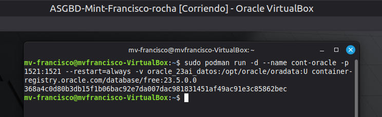  
sudo podman ps
  
sudo podman ps -a  
  
sudo podman logs cont-oracle
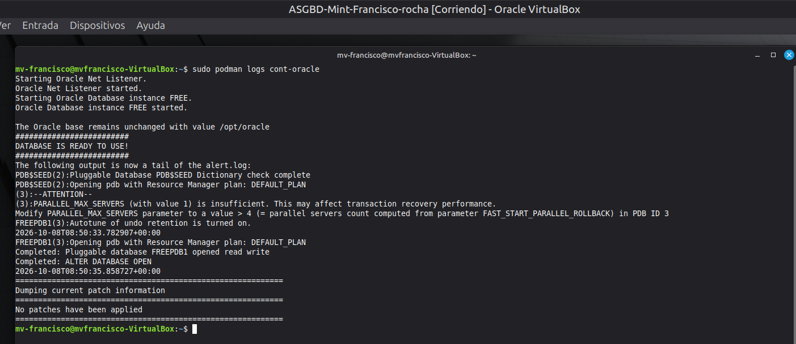  
3.Entrar en Oracle y crear el usuario de trabajo  
sudo podman exec -it cont-oracle /bin/bash  
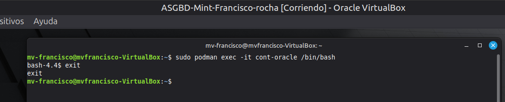  
sudo podman exec -it cont-oracle sqlplus / as sysdba  
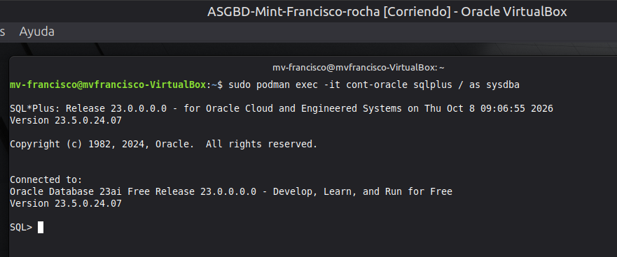 
```sql
ALTER SESSION SET CONTAINER = FREEPDB1;
CREATE USER orauser IDENTIFIED BY "TU_CLAVE";
GRANT CREATE SESSION, CREATE TABLE TO orauser;
ALTER USER orauser QUOTA 100M ON USERS;
EXIT;
```  
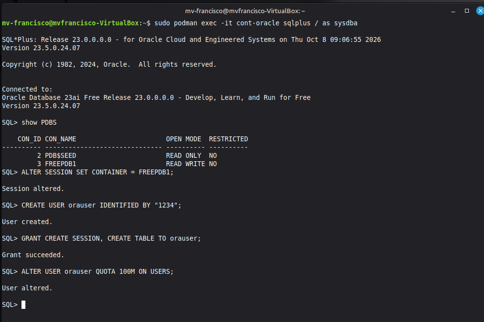  
sudo podman exec -it cont-oracle sqlplus orauser@//localhost:1521/FREEPDB1  
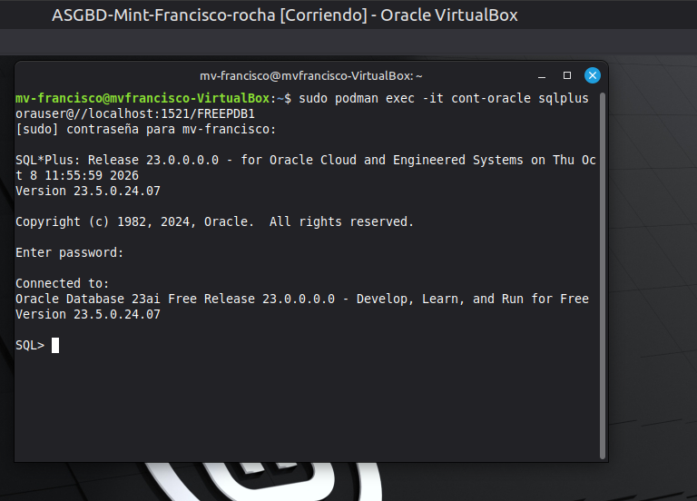 
2. Desplegar PostgreSQL
sudo apt install postgresql postgresql-contrib php-pgsql  
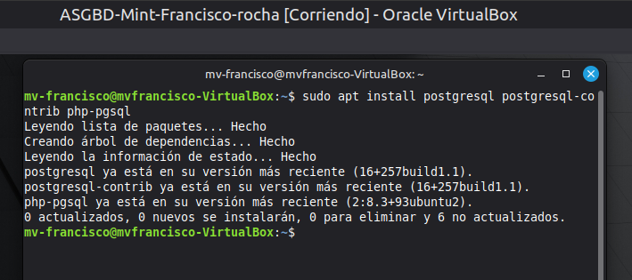  
sudo systemctl start postgresql
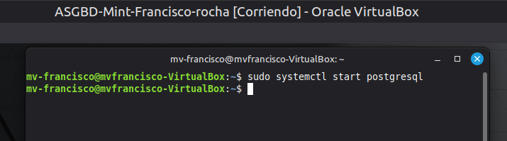   
sudo systemctl enable postgresql  
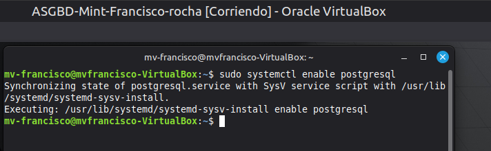  
sudo -i -u postgres
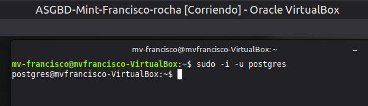  
psql  
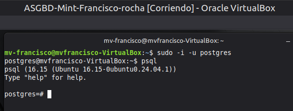  

```sql
CREATE DATABASE dbpg;
CREATE USER pguser WITH PASSWORD 'TU_CLAVE';
GRANT ALL PRIVILEGES ON DATABASE dbpg TO pguser;
\q
```
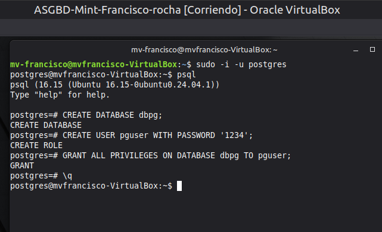  
psql -h localhost -U pguser -d dbpg -W  
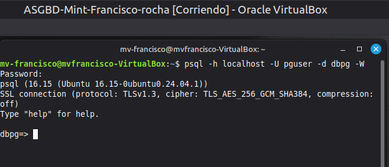  
3. Desplegar MariaDB
sudo apt install mariadb-server mariadb-client
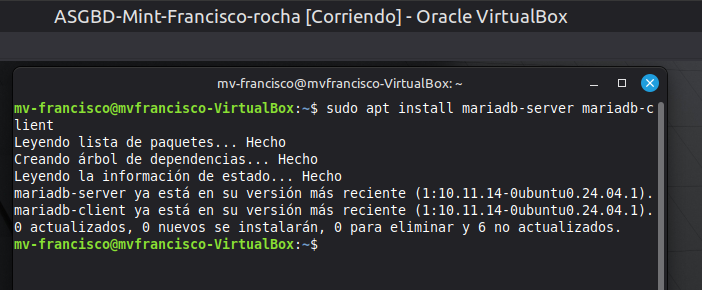  
sudo systemctl enable --now mariadb  
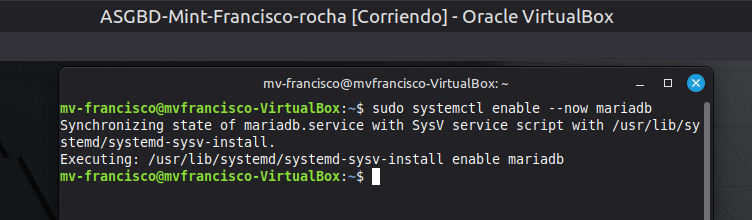
sudo mariadb
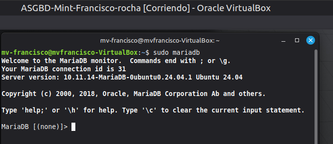

